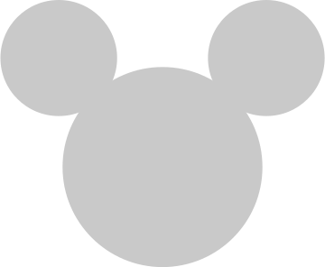

<!-- ALL-CONTRIBUTORS-BADGE:START - Do not remove or modify this section -->

<!-- ALL-CONTRIBUTORS-BADGE:END -->
  

<h1 align="center">
  Disney API
</h1>

Disney API is a restful API based on Disney characters. Using this API you can get information on Disney characters and movies.

## 💫Getting started

Check out the [documentation](https://www.disneyapi.dev)

This project follows the [all-contributors](https://github.com/all-contributors/all-contributors) specification. Contributions of any kind welcome!

## Contributors ✨

Thanks goes to these wonderful people ([emoji key](https://allcontributors.org/docs/en/emoji-key)):

<!-- ALL-CONTRIBUTORS-LIST:START - Do not remove or modify this section -->
<!-- prettier-ignore-start -->
<!-- markdownlint-disable -->
<table>
  <tr>
    <td align="center"><a href="https://www.manuela.dev/"> <b>Manu Castrillon</b></a> <a href="https://github.com/ManuCastrillonM/disney-api/commits?author=ManuCastrillonM" title="Code">💻</a> <a href="https://github.com/ManuCastrillonM/disney-api/commits?author=ManuCastrillonM" title="Documentation">📖</a></td>
  </tr>
</table>

<!-- markdownlint-restore -->
<!-- prettier-ignore-end -->

<!-- ALL-CONTRIBUTORS-LIST:END -->

This project follows the [all-contributors](https://github.com/all-contributors/all-contributors) specification. Contributions of any kind welcome!
